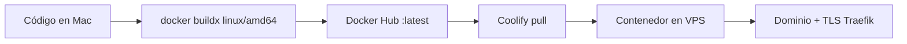

# Playbook: despliegue con Coolify + imagen Docker precompilada

Guía **reutilizable** para desplegar apps (API Nest, Angular, Next, etc.) en tu VPS con Coolify **sin compilar en el servidor**.

Usado en FactoFarm (`api-factofarm` + `front-factofarm`). Sirve igual para store, tips u otra app.

---

## Idea central

| Problema | Decisión |
|----------|----------|
| VPS pequeño (1 vCPU / 4 GB): `nest build` / `ng build` se cuelga o satura CPU | **No construir en el VPS** |
| GitHub Actions bloqueado / no quieres pagar CI | **Build en tu Mac (Docker Desktop)** |
| Coolify Nixpacks/Dockerfile en el server = mismo cuello de botella | Pack **`dockerimage`**: Coolify solo hace `pull` + `run` |
| Muchas tags de prueba ensucian Docker Hub | **Solo `latest`** (sobreescribir) |



**Regla de oro:** el VPS ejecuta; tu Mac (o un CI barato) compila.

---

## Piezas del sistema

1. **Dockerfile** en el repo (multi-stage: build → imagen runtime pequeña).
2. **`.dockerignore`** estricto (nunca subir `.pnpm-store`, `node_modules`, `.git`, `dist`).
3. **Docker Hub** (u otro registry): `usuario/nombre-app:latest`.
4. **Coolify** proyecto → environment `production` → app tipo **Docker Image**.
5. **Postgres** (u otro servicio) en Coolify, en la misma red Docker (`coolify`).
6. **Dominio** apuntando al VPS (A record); Coolify/Traefik emite HTTPS.

---

## Backend (Nest / API) vs Frontend (SPA)

### Backend

- Runtime: Node Alpine (o similar).
- Entrypoint típico: migraciones + arrancar API.
- Env **en Coolify** (runtime): `DATABASE_URL`, secretos JWT, CORS, etc.
- En el **build** de la imagen solo hace falta un `DATABASE_URL` placeholder si Prisma necesita generar cliente.
- `DATABASE_URL` de Coolify usa el **hostname interno** del contenedor Postgres (`xxx:5432`), no la IP pública.
- Desde tu Mac, para `prisma migrate deploy` / seed, usa el **puerto público** del Postgres (si está habilitado).
- Healthcheck: ruta HTTP real (ej. `/api/health`). En Alpine instala **`curl`** (Coolify lo usa).

### Frontend (Angular / Vite / estático)

- Runtime: **nginx** sirviendo `dist/`.
- Variables `NG_APP_*` / `VITE_*` se **hornean en el build** (no hay env de runtime en el browser).
- Pasa URLs de API y site como `--build-arg` al `docker build`.
- Puerto expuesto: `80`.
- Healthcheck: `GET /`.
- También necesita `curl` (o equivalente) en la imagen si Coolify hace healthcheck dentro del contenedor.

---

## Checklist para una app nueva

Copia y completa:

### 1. Repo

- [ ] `Dockerfile` multi-stage (build local → runtime mínimo).
- [ ] `.dockerignore` (excluir store de pnpm/npm, `node_modules`, `.env`).
- [ ] Healthcheck usable: backend ruta JSON; front `/`.
- [ ] Alpine: `apk add --no-cache curl` en la etapa final.

### 2. Docker Hub

- [ ] Repo público o privado: `santossjba/<nombre-app>`.
- [ ] Solo tag **`latest`** (no acumular tags de prueba).

### 3. Coolify

- [ ] Proyecto correcto (ej. FACTO FARM / FACTOSYS STORE…).
- [ ] Environment `production`.
- [ ] Create application → **Docker Image** (sin git build).
- [ ] Image: `santossjba/<nombre-app>`, tag: `latest`.
- [ ] `ports_exposes`: `3000` (API) o `80` (nginx).
- [ ] Domain: `https://tu-subdominio.tudominio.com`.
- [ ] Healthcheck habilitado (path + puerto correctos; start period generoso si hay migraciones).
- [ ] Variables runtime cargadas (nunca en la imagen si son secretos).

### 4. Base de datos (si aplica)

- [ ] DB en Coolify, misma red que la app.
- [ ] Crear database dedicada (ej. `miapp_db`).
- [ ] `DATABASE_URL` interno en la app Coolify.
- [ ] Migraciones aplicadas (entrypoint o comando local con URL pública).

### 5. CORS / front

- [ ] API: `FRONTEND_URL` + `CORS_ORIGINS` con el dominio HTTPS del front.
- [ ] Front build: API base URL = dominio público del API (`https://api-..../api/v1`).

---

## Comandos plantilla (copiar/pegar)

Sustituye `NOMBRE`, puertos y URLs.

### Build + push (siempre amd64 para el VPS)

```bash
cd /ruta/a/tu-repo

docker buildx build --platform linux/amd64 \
  -t santossjba/NOMBRE:latest \
  --push .
```

Front con env de build:

```bash
docker buildx build --platform linux/amd64 \
  --build-arg NG_APP_API_BASE_URL=https://api.ejemplo.com/api/v1 \
  --build-arg NG_APP_PRODUCTION=true \
  --build-arg NG_APP_SITE_URL=https://app.ejemplo.com \
  -t santossjba/NOMBRE:latest \
  --push .
```

### Migraciones (solo API, desde Mac)

```bash
export NODE_OPTIONS='--experimental-require-module'   # si usas Prisma 7
# DATABASE_URL en .env apunta al Postgres alcanzable desde tu Mac
pnpm exec prisma migrate deploy
```

### Redeploy Coolify

1. UI → app → Deploy / Force rebuild (pull `latest`).
2. Esperar healthcheck green.
3. Probar URL pública.

### Limpieza

```bash
# Local: solo deja latest de esa app
docker images | grep NOMBRE
# Docker Hub: borra tags viejos; deja solo latest
```

---

## Ejemplo FactoFarm (referencia)

| App | Imagen | URL | Puerto |
|-----|--------|-----|--------|
| API | `santossjba/api-factofarm:latest` | https://api-factofarm.factosysperu.com | 3000 |
| Front | `santossjba/front-factofarm:latest` | https://factofarm.factosysperu.com | 80 |
| Postgres | Coolify `postgresql-db` (FACTOSYS PERU) | red interna + opcional `:5433` público | 5432 |

Pasos detallados por repo:

- Frontend: `README.md` (este repo) → sección **Despliegue en Coolify**
- Backend: repo `api-factofarm` → `README.md` → **Despliegue en Coolify** (mismo playbook en `docs/COOLIFY-DOCKER-DEPLOY.md`)

---

## Errores típicos (y qué hacer)

| Síntoma | Causa | Solución |
|---------|--------|----------|
| Build en Coolify tarda horas / CPU limitation | Compilar en el VPS | Cambiar a pack `dockerimage` + build en Mac |
| Healthcheck falla: `curl: not found` | Alpine sin curl | `apk add --no-cache curl` en runner |
| Contenedor exit / migrate fail | Migración rota o BD inconsistente | Revisar logs; `migrate deploy` / reparar historial |
| Mac no conecta a Postgres (`hostname` Coolify) | Host interno solo existe en Docker | Usar IP/puerto público desde Mac; interno en Coolify |
| Prisma P1001 a dominio con IPv6 | IPv6 del DNS no llega al 5433 | Usar IPv4 del VPS en `DATABASE_URL` local |
| Front llama a `localhost` en prod | Env no horneada en build | Rebuild con `--build-arg` correctos |
| Safari: `@context`.toLowerCase | JSON-LD como array root | Usar objeto con `@context` + `@graph` |
| Muchas imágenes en Docker Hub | Tags temporales | Solo `latest`; borrar el resto |

---

## Qué no hacer

- Compilar Nest/Angular en el VPS KVM 1 “porque Coolify puede”.
- Crear tags `2026-....-fix1`, `fix2` por cada intento.
- Meter `.env` con secretos en la imagen o en git.
- Usar `prisma migrate reset` en producción sin consentimiento explícito (borra datos).
- Apuntar la app Coolify al `DATABASE_URL` público si puede usar la red interna (más lento y frágil).

---

## Resumen en una frase

> **Compila en la Mac → sube `usuario/app:latest` → Coolify solo hace pull y corre → dominio HTTPS.**

Ese es el patrón a repetir en cada app nueva.
